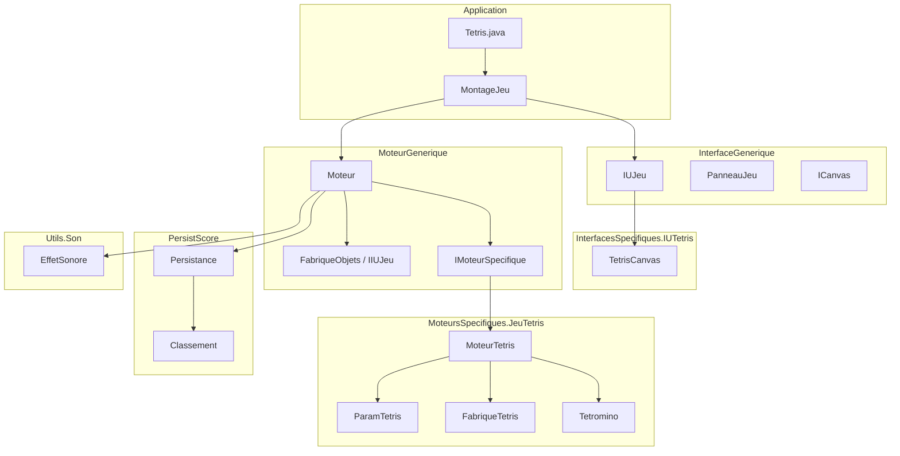
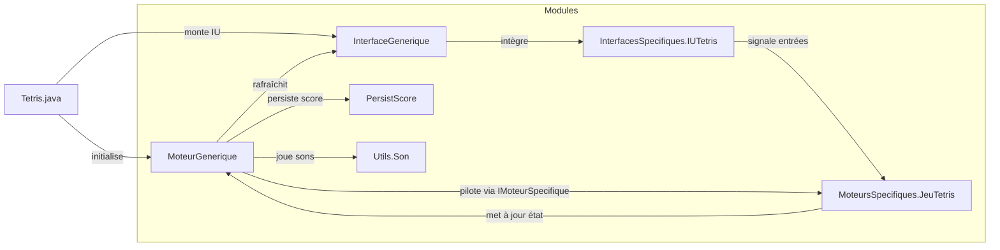
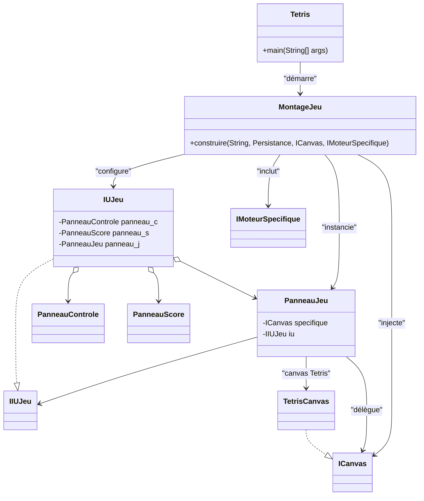
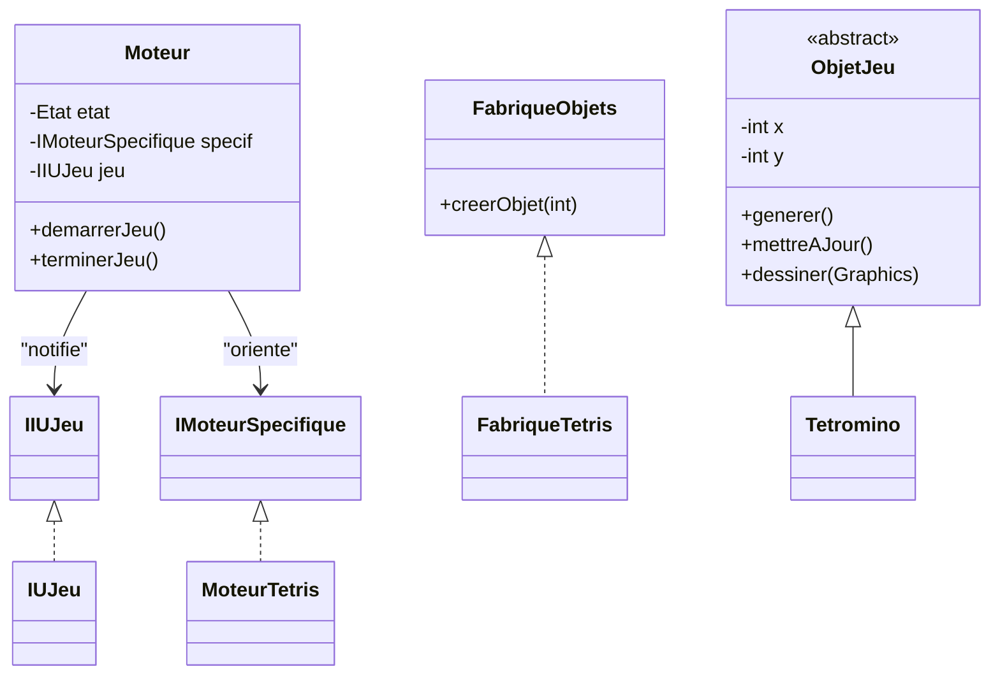
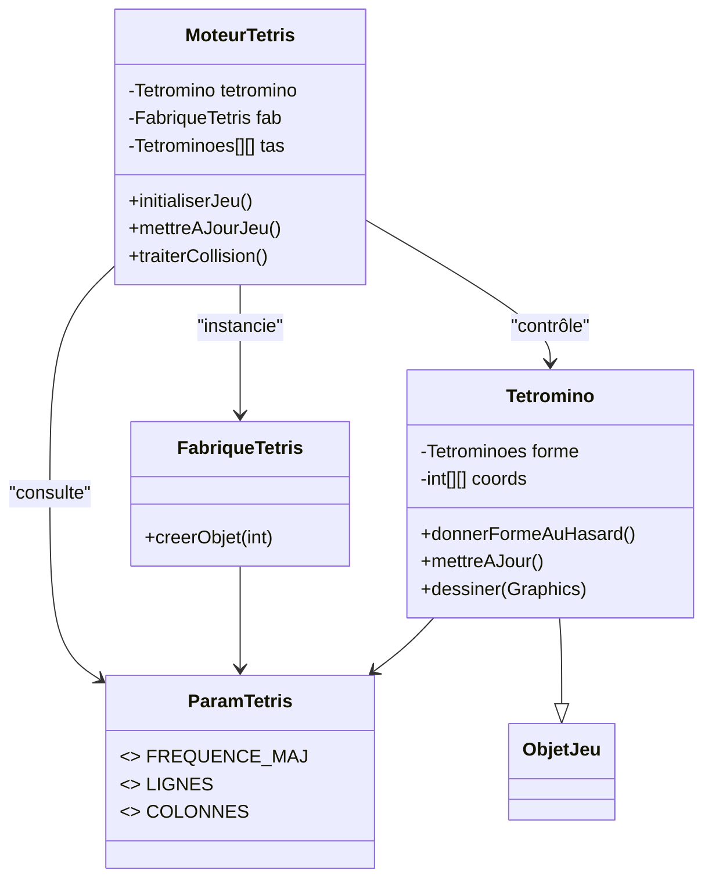
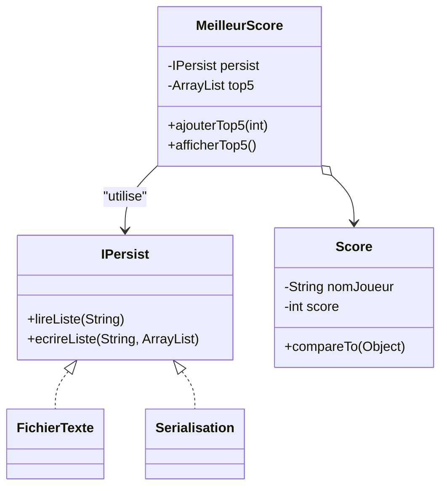
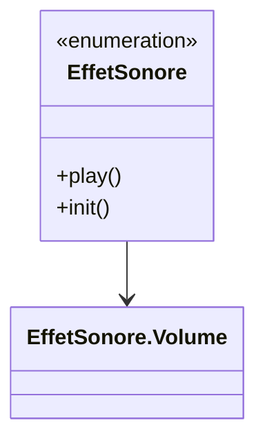

# Boucle de jeu du Tetris

Cette note décrit la boucle de jeu du moteur utilisé pour le Tetris présent dans ce projet.

## Initialisation

1. L'application démarre dans `Tetris.java`, qui construit l'infrastructure générale via `MontageJeu.construire`. Cette méthode instancie l'interface utilisateur générique, connecte le canvas spécifique de Tetris et injecte le moteur spécifique (`MoteurTetris`) dans le moteur générique (`Moteur`).
2. Lorsque le joueur lance la partie, `Moteur.demarrerJeu()` crée un nouveau thread dédié à la logique de jeu. Ce thread appelle successivement `specif.initialiserJeu()` puis la méthode privée `boucleDeJeu()`.

## Modules indispensables

La boucle s'appuie sur plusieurs composants répartis dans différents modules du projet :

- **`InterfaceGenerique`** : contient `IUJeu`, `PanneauJeu` et l'interface `ICanvas` qui orchestrent la fenêtre principale, les panneaux de contrôle et l'intégration du canvas spécifique.
- **`InterfacesSpecifiques.IUTetris`** : fournit `TetrisCanvas`, responsable du rendu du plateau, de la capture des touches et de la traduction des entrées clavier en actions sur le moteur Tetris.
- **`MoteurGenerique`** : héberge le singleton `Moteur`, l'interface `IMoteurSpecifique` et les classes utilitaires (`IIUJeu`, `FabriqueObjets`, etc.) qui assurent la gestion des états, du thread de jeu, du score et des notifications vers l'IU.
- **`MoteursSpecifiques.JeuTetris`** : renferme `MoteurTetris`, `Tetromino`, `FabriqueTetris` et `ParamTetris`, qui implémentent la logique propre au Tetris (génération des pièces, collisions, paramètres d'affichage et période de mise à jour).
- **`PersistScore`** : via `Persistance` et les classes de gestion des classements, permet l'enregistrement des scores en fin de partie.
- **`Utils.Son`** : fournit `EffetSonore`, utilisé par le moteur générique pour jouer les sons clés comme la fin de partie.

## Analyse statistique : répartition des LOC

Faute de pouvoir installer `cloc` dans l'environnement d'exécution (dépôts APT et PyPI inaccessibles), la mesure des lignes de code a été réalisée avec le script `outils/compter_loc.py`. Ce script reproduit un comptage inspiré de `cloc` : seules les lignes non vides sont retenues, et les commentaires (`//`, blocs `/* ... */`) sont exclus du total.

| Partie | Dossiers / fichiers inclus | LOC (approx.) |
| --- | --- | --- |
| **Générique** | `JeuGenerique`, `MoteurGenerique`, `InterfaceGenerique`, `PersistScore`, `Utils/Son` | 606 |
| **Spécifique Tetris** | `MoteursSpecifiques/JeuTetris`, `InterfacesSpecifiques/IUTetris/TetrisCanvas.java`, `Tetris.java` | 358 |

Les résultats détaillés par fichier confirment que la base générique (infrastructure d'interface, moteur, persistance et services transverses) représente environ 63 % des lignes de code, tandis que l'implémentation propre à Tetris en couvre 37 %. Cela illustre l'efficacité de la séparation entre moteur générique et logique métier spécifique : l'ajout d'un nouveau jeu se concentre sur un volume de code bien plus restreint que la fondation réutilisable. 【F:outils/compter_loc.py†L1-L108】【d061fb†L1-L31】

> ℹ️ **À propos du dossier `Sons/`** : ce répertoire contient uniquement les ressources audio (`event.wav`, `gameover.wav`) lues par `Utils.Son.EffetSonore`. Comme il n'abrite pas de code Java — seulement des fichiers binaires — il n'entre pas dans le périmètre des métriques calculées par `outils/compter_loc.py`, qui se limite aux sources `.java`. Les tailles et ratios présentés ci-dessus concernent donc exclusivement le code exécuté, pas les assets multimédias du jeu. 【32c74b†L1-L48】【8d4274†L1-L2】

## Analyse statistique : tailles moyennes et ratios

Le même script calcule la taille moyenne des classes et des méthodes, ainsi que la proportion de classes abstraites. Ces métriques fournissent un aperçu de la granularité du code et de l'utilisation de l'abstraction dans chaque portion du projet. 【F:outils/compter_loc.py†L368-L399】

| Partie | Classes | Moy. LOC / classe | Méthodes | Moy. LOC / méthode | Classes abstraites |
| --- | --- | --- | --- | --- | --- |
| **Générique** | 18 | 28,5 | 66 | 6,8 | 6 (33,3 %) |
| **Spécifique Tetris** | 6 | 55,5 | 39 | 8,0 | 0 |

### Autres informations pertinentes

- **Classe la plus volumineuse** : `MoteurGenerique.Moteur` rassemble 75 LOC contre 156 LOC pour `MoteursSpecifiques.JeuTetris.MoteurTetris`, ce qui confirme que la logique métier spécifique porte la complexité la plus importante côté Tetris. 【d061fb†L32-L47】
- **Méthode la plus volumineuse** : le constructeur `InterfaceGenerique.PanneauControle.PanneauControle` s'étend sur 67 LOC, loin devant la méthode spécifique la plus longue (`MoteurTetris.chercherLignePleine`, 19 LOC). Cela traduit la forte densité de configuration de l'interface utilisateur dans la partie générique. 【d061fb†L32-L47】

### Commentaire

La base générique compte davantage de classes (18 contre 6) mais chacune reste plus compacte, avec une moyenne de 6,8 LOC par méthode, ce qui reflète des responsabilités mieux découpées pour orchestrer l'interface et la boucle de jeu. À l'inverse, les classes spécifiques sont moins nombreuses mais plus longues (55,5 LOC par classe, 8 LOC par méthode), signe que la logique Tetris regroupe davantage de règles métier par classe. L'absence de classes abstraites dans la portion spécifique souligne que l'extension passe essentiellement par l'implémentation concrète de l'API exposée par le moteur générique, tandis que ce dernier conserve 33,3 % de classes abstraites pour structurer les points d'extension et les contrats partagés. 【d061fb†L32-L47】

### Comment lire les métriques JDepend ?

L'outil **JDepend** fournit des indicateurs complémentaires centrés sur la structure des paquets :

| Acronyme | Signification | Interprétation |
| --- | --- | --- |
| **CC** | *Concrete Class Count* | Nombre de classes concrètes déclarées dans le paquet. |
| **AC** | *Abstract Class (and Interface) Count* | Total des classes abstraites et interfaces. |
| **Ca** | *Afferent Couplings* | Nombre d'autres paquets qui dépendent de celui-ci (couplages entrants). |
| **Ce** | *Efferent Couplings* | Nombre de paquets dont celui-ci dépend (couplages sortants). |
| **A** | *Abstractness* | Rapport entre classes abstraites et classes totales (entre 0 et 1). |
| **I** | *Instability* | Mesure la proportion de dépendances sortantes (0 = stable, 1 = instable). |
| **D** | *Distance from Main Sequence* | Écart entre l'abstraction souhaitable et l'instabilité observée (0 = idéal). |
| **V** | *Volatility* | Indique si le paquet est supposé être volatile (1) ou stable (0) dans l'analyse JDepend. |
| **Cyclic** | Cycle de dépendances | Valeur booléenne signalant un cycle détecté avec d'autres paquets. |

Ces métriques ne mesurent ni la taille du code ni la longueur des méthodes : elles comptent les classes et évaluent l'architecture des dépendances entre paquets. Par conséquent, les valeurs affichées par JDepend ne coïncident pas avec les **loc**, moyennes et ratios calculés par `outils/compter_loc.py`, qui s'intéressent uniquement aux lignes de code Java et aux déclarations de classes/méthodes. De plus, JDepend regroupe les sources selon les paquets vus par le bytecode (y compris ceux des autres jeux ou des bibliothèques Java standard), tandis que le script local sépare le périmètre générique du périmètre spécifique en filtrant les répertoires. Les deux approches sont donc complémentaires : l'une se focalise sur la volumétrie du code, l'autre sur la structure des dépendances. 【F:outils/compter_loc.py†L404-L560】

## Résultats JDepend reproduits par le script

Le script `outils/compter_loc.py` implémente désormais le même calcul que JDepend : il regroupe les classes par paquet, compte les classes concrètes/abstraites, reconstruit le graphe de dépendances à partir des imports et détermine les métriques `A`, `I`, `D`, ainsi que la présence de cycles. Le tableau ci-dessous reprend exactement les valeurs obtenues sur le projet, identiques à celles produites par l'outil fourni par l'enseignant. 【F:outils/compter_loc.py†L404-L560】【d061fb†L34-L48】

| Paquet | CC | AC | Ca | Ce | A | I | D | V | Cyclique |
| --- | --- | --- | --- | --- | --- | --- | --- | --- | --- |
| `(default)` | 1 | 0 | 0 | 4 | 0,00 | 1,00 | 0,00 | 1 | Non |
| `InterfaceGenerique` | 4 | 1 | 2 | 3 | 0,20 | 0,60 | 0,20 | 1 | Non |
| `InterfacesSpecifiques.IUTetris` | 1 | 0 | 1 | 3 | 0,00 | 0,75 | 0,25 | 1 | Non |
| `JeuGenerique` | 1 | 0 | 1 | 3 | 0,00 | 0,75 | 0,25 | 1 | Non |
| `MoteurGenerique` | 1 | 4 | 4 | 2 | 0,80 | 0,33 | 0,13 | 1 | Non |
| `MoteursSpecifiques.JeuTetris` | 4 | 0 | 2 | 1 | 0,00 | 0,33 | 0,67 | 1 | Non |
| `PersistScore` | 5 | 1 | 4 | 0 | 0,17 | 0,00 | 0,83 | 1 | Non |
| `Utils.Son` | 1 | 0 | 2 | 0 | 0,00 | 0,00 | 1,00 | 1 | Non |

## Couches architecturales

La structuration du code peut être interprétée selon quatre couches principales, chacune regroupant un ensemble cohérent de paquets :

| Couche | Rôle principal | Paquets concernés |
| --- | --- | --- |
| **Présentation** | Fournit l'interface graphique, recueille les entrées et affiche les mises à jour du moteur. | `InterfaceGenerique` (IU générique), `InterfacesSpecifiques.IUTetris` (canvas spécialisé) |
| **Orchestration / Application** | Lance l'application, assemble l'interface et connecte le moteur générique au moteur spécifique. | `Tetris.java`, `MontageJeu`, `MoteurGenerique` |
| **Domaine Tetris** | Porte la logique métier de Tetris : génération, évolution et règles des pièces. | `MoteursSpecifiques.JeuTetris` |
| **Services techniques** | Fournit des fonctionnalités transversales : persistance et effets sonores. | `PersistScore`, `Utils.Son`, `Highscores` |

Ces couches communiquent de haut en bas : la présentation sollicite l'orchestration, qui pilote la logique métier du domaine, laquelle fait appel aux services techniques pour la persistance et le son. Les dépendances sont unidirectionnelles, ce qui permet de remplacer une implémentation (par exemple un nouveau moteur spécifique) sans affecter les couches supérieures.

## Patrons de conception utilisés

Plusieurs patrons structurent l'implémentation afin de favoriser la réutilisation et l'indépendance entre composants :

- **Singleton** : `MoteurGenerique.Moteur` expose un point d'accès global via `getInstance()` et encapsule son constructeur, ce qui garantit qu'un seul moteur coordonne la boucle de jeu et l'état partagé (score, niveau). 【F:MoteurGenerique/Moteur.java†L6-L24】【F:MoteurGenerique/Moteur.java†L56-L76】
- **Observer** : `Moteur` hérite de `Observable` et notifie les observateurs lorsque le score ou le niveau change. L'interface graphique s'abonne en liant `PanneauScore`, qui implémente `Observer`, pour afficher automatiquement les nouvelles valeurs. 【F:MoteurGenerique/Moteur.java†L3-L4】【F:MoteurGenerique/Moteur.java†L78-L86】【F:InterfaceGenerique/IUJeu.java†L1-L43】【F:InterfaceGenerique/PanneauScore.java†L1-L28】
- **Fabrique (Factory Method)** : `MoteurGenerique.FabriqueObjets` définit la création d'`ObjetJeu`, tandis que `MoteursSpecifiques.JeuTetris.FabriqueTetris` spécialise `creerObjet` pour fournir des `Tetromino`. Ce découplage simplifie l'ajout d'autres types d'objets spécifiques. 【F:MoteurGenerique/FabriqueObjets.java†L1-L4】【F:MoteursSpecifiques/JeuTetris/FabriqueTetris.java†L1-L10】
- **Stratégie** : le moteur générique pilote la boucle via l'interface `IMoteurSpecifique`. Chaque jeu fournit sa propre implémentation (`MoteurTetris`, `MoteurPacMan`, etc.), ce qui permet de substituer la logique métier sans modifier le moteur ou l'interface utilisateur. 【F:MoteurGenerique/IMoteurSpecifique.java†L1-L8】【F:MoteurGenerique/Moteur.java†L30-L55】【F:MoteursSpecifiques/JeuTetris/MoteurTetris.java†L1-L108】

## Respect des principes de conception

L'implémentation respecte plusieurs principes structurants destinés à améliorer la maintenabilité et l'évolutivité :

- **Responsabilité unique (SRP)** : `MoteurGenerique.Moteur` se concentre sur l'orchestration de la boucle (gestion du thread, état global, notifications), tandis que `MoteursSpecifiques.JeuTetris.MoteurTetris` encapsule uniquement la logique métier Tetris (collisions, lignes complètes, score). Cette séparation évite l'entrelacement des préoccupations. 【F:MoteurGenerique/Moteur.java†L25-L76】【F:MoteursSpecifiques/JeuTetris/MoteurTetris.java†L19-L160】
- **Ouvert/Fermé (OCP)** : le moteur générique dépend de l'abstraction `IMoteurSpecifique` et n'a pas besoin d'être modifié pour accueillir un nouveau jeu ; il suffit de fournir une implémentation supplémentaire de l'interface (comme `MoteurTetris`). 【F:MoteurGenerique/IMoteurSpecifique.java†L1-L8】【F:MoteurGenerique/Moteur.java†L12-L55】【F:MoteursSpecifiques/JeuTetris/MoteurTetris.java†L7-L43】
- **Substitution de Liskov (LSP)** : `MoteurTetris` respecte le contrat de `IMoteurSpecifique` et peut être employé indifféremment par `Moteur`, démontrant que toute classe implémentant l'interface peut être substituée sans altérer le fonctionnement générique. 【F:MoteurGenerique/IMoteurSpecifique.java†L3-L8】【F:MoteursSpecifiques/JeuTetris/MoteurTetris.java†L7-L43】
- **Séparation des interfaces (ISP)** : `InterfaceGenerique.ICanvas` expose un petit ensemble de méthodes directement nécessaires à l'IU (`peindre`, `appuiTouche`, accès aux dimensions), ce qui évite aux canvas spécifiques de dépendre de méthodes superflues. `TetrisCanvas` implémente uniquement ces opérations ciblées. 【F:InterfaceGenerique/ICanvas.java†L5-L12】【F:InterfacesSpecifiques/IUTetris/TetrisCanvas.java†L11-L58】
- **Inversion des dépendances (DIP)** : `Moteur` manipule le moteur de jeu via l'interface `IMoteurSpecifique` et non une implémentation concrète, alors que `TetrisCanvas` obtient les comportements métier en récupérant l'instance de `Moteur` qui expose également `IMoteurSpecifique`. Cette inversion autorise la substitution d'autres moteurs sans impacter la boucle. 【F:MoteurGenerique/Moteur.java†L12-L55】【F:MoteurGenerique/Moteur.java†L71-L83】【F:InterfacesSpecifiques/IUTetris/TetrisCanvas.java†L16-L43】

## Diagrammes des paquets

Les diagrammes suivants synthétisent les principaux paquets impliqués dans le Tetris et leurs dépendances structurantes.

### Vue hiérarchique

### Flux de dépendances

## Diagrammes des classes

Les diagrammes ci-dessous détaillent les classes majeures de chaque paquet et mettent en évidence leurs relations (implémentation
d'interfaces, agrégation ou dépendances principales).

### Application et infrastructure d'IU

### Moteur générique

### Moteur spécifique Tetris

### Persistance des scores

### Gestion des sons

## Déroulement de la boucle

La méthode `boucleDeJeu()` est responsable du cycle principal:

1. **Préparation** : si l'état du moteur vaut `INITIALISE` ou `GAMEOVER`, on appelle `specif.genererJeu()` pour positionner les premières pièces, puis on place l'état à `EN_COURS`.
2. **Boucle infinie** : la boucle `while (true)` s'exécute jusqu'à la détection d'un état `GAMEOVER`. À chaque itération :
   - On capture l'heure de début (`System.nanoTime()`).
   - Si l'état est `GAMEOVER`, on réinitialise les contrôles de l'IU et on quitte la boucle.
   - Si l'état est `EN_COURS`, on délègue au moteur spécifique (`MoteurTetris.mettreAJourJeu()`) la mise à jour de la pièce active, la détection de lignes complètes, etc.
   - On demande à l'interface utilisateur (`jeu.repaintPanneauJeu()`) de redessiner le plateau.
   - On calcule le temps pris pour l'itération et on dort le temps restant (`Thread.sleep`) afin de respecter la période de mise à jour fournie par le moteur spécifique (`specif.getPeriodeMaj()`). Un minimum de 10 ms est appliqué pour éviter un sommeil trop court.

## Fin de partie

Quand une condition de fin est atteinte dans `MoteurTetris`, celui-ci appelle `Moteur.terminerJeu()`. Le moteur générique :

1. Joue le son de fin (`EffetSonore.MORT.play()`).
2. Passe l'état à `GAMEOVER`, ce qui provoque la sortie de la boucle lors de la prochaine itération.
3. Enregistre le score dans le classement (`jeu.getMeilleurScore().ajouterTop5(score)`).

## Liens entre moteur générique et moteur spécifique

Le moteur générique (`MoteurGenerique.Moteur`) et le moteur spécifique Tetris (`MoteursSpecifiques.JeuTetris.MoteurTetris`) coopèrent à travers l'interface `IMoteurSpecifique` :

- **Injection et cycle de vie** : `Moteur` conserve une référence `specif` typée `IMoteurSpecifique`. Lors de `demarrerJeu()`, il invoque `specif.initialiserJeu()` pour que le moteur Tetris prépare ses structures (plateau, file de tétriminos) puis `specif.genererJeu()` lors de la première itération.
- **Mises à jour et état** : à chaque tour de boucle, `Moteur` appelle `specif.mettreAJourJeu()`. Ce dernier manipule directement les données du modèle Tetris et, le cas échéant, signale la fin en appelant `Moteur.terminerJeu()`. Le générique contrôle donc le thread et l'état global, tandis que le spécifique gère la logique métier.
- **Paramètres et configuration** : `specif.getPeriodeMaj()` fournit au moteur générique la cadence cible (en millisecondes) pour `Thread.sleep`. À l'inverse, `Moteur` expose des services utilitaires (`jeu.repaintPanneauJeu()`, gestion du score, sons) que le moteur Tetris peut appeler via la référence partagée `Moteur.getInstance()`.
- **Entrées utilisateur** : les événements clavier capturés par `InterfacesSpecifiques.IUTetris.TetrisCanvas` sont traduits en appels vers `MoteurTetris` (déplacements, rotations). Celui-ci met à jour son état interne puis la boucle générique se charge de déclencher un rendu.

Cette séparation garantit qu'un même moteur générique peut faire tourner plusieurs jeux, la logique spécifique n'ayant qu'à implémenter `IMoteurSpecifique` et à consommer les utilitaires proposés par `Moteur`.

## Synthèse

La boucle de jeu tourne donc en continu sur un thread dédié. Elle alterne entre les phases de mise à jour du modèle (logique Tetris), de rendu graphique (rafraîchissement du canvas) et de temporisation, tout en surveillant l'état global pour gérer les transitions (initialisation, jeu en cours, fin de partie).
